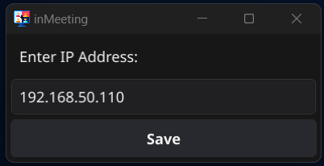

# inMeeting
inMeeting is a MacOS and Windows 11 cross-platform Golang app that automatically turn on your Raspberry Pi Unicorn Mini Hat light when you're in a meeting! 

It leverages [fyne](https://fyne.io/) to create its UI and [go-media-devices-state](https://github.com/dqle/go-media-devices-state) to listen for microphone and camera states on MacOS and Windows 11. If it detects either microphone or camera is in use, it will send a POST request to a Raspberry Pi w/ Unicorn hat Mini running Python Flask to turn on the light and will send another POST request to turn off otherwise. 

Its system tray icon will change color depending on the states of the microphone and camera devices, indicating whether it's on or off.

See the demo below:

https://github.com/user-attachments/assets/f4eae47d-51b2-4a76-9fe9-ff46029f32b9

# Raspberry Pi Setup

- Raspberry Pi Zero WH (or any Raspberry Pi with internet connection)
- [Unicorn Hat Mini](https://www.pishop.us/product/unicorn-hat-mini/)

1. Image the raspberry pi micro sd card using the official Raspberry Pi Imager: https://www.raspberrypi.com/software/
2. For OS, use the **Raspberry Pi Lite (32-bit)** version. Make sure that both are using the **_SAME WIFI NETWORK_**. Distro version doesn't matter, but for best compatibility, use **bullseye** distribution
3. Once pi is boot up, run the below command to setup Pi:
```
sudo bash -c "$(curl -fsSL https://raw.githubusercontent.com/dqle/inMeeting/main/pi-setup.sh)"
```

# How to use

1. Download the appropriate package for your OS under the Release page and run it.
2. Right-click the program, select `Settings` and enter your Raspberry Pi IP Address:

    
3. Save settings and join a meeting!